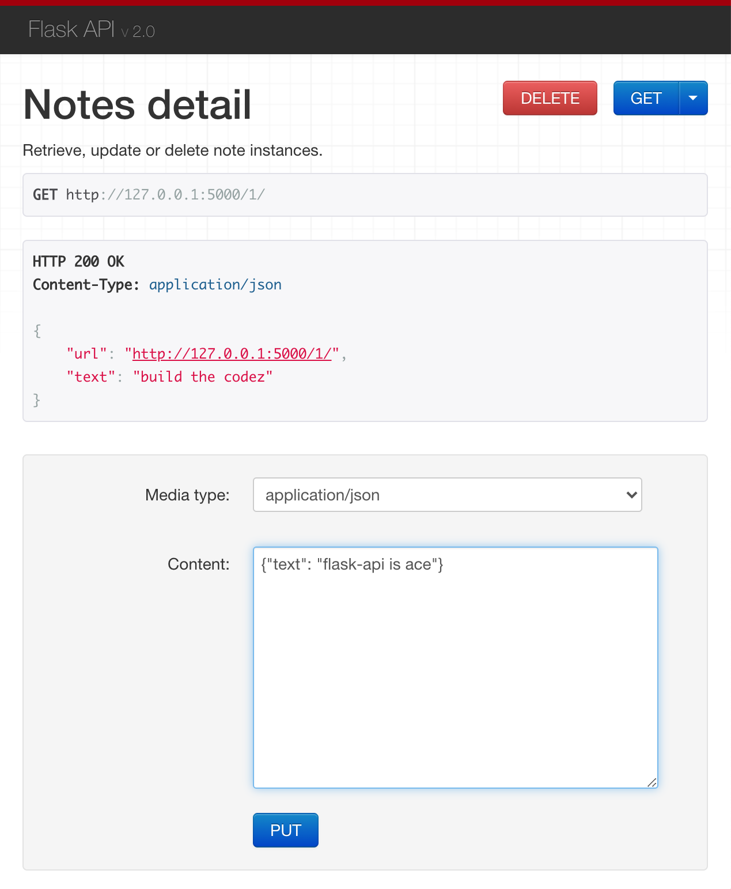

# Flask API

Browsable Web APIs for Flask

---

## Overview

Flask API is an implementation of the same web browsable APIs that [Django REST framework][django-rest-framework] provides.

It gives you properly content negotiated responses and smart request parsing.

It is currently a work in progress, but the fundamentals are in place and you can already start building kick-ass browsable Web APIs with it.  If you want to start using Flask API right now go ahead and do so, but be sure to follow the release notes of new versions carefully.

## Roadmap

Future work on getting Flask API to a 1.0 release will include:

* Authentication, including session, basic and token authentication.
* Permissions, including a simple user-is-authenticated permission.
* Throttling, including a base rate throttling implementation.
* Support for using class based views, including the base view class.
* Browsable API improvements, such as breadcrumb generation.
* Customizable exception handling.
* CSRF protection for session authenticated requests.
* Login and logout views for the browsable API.
* Documentation on how to deal with request validation.
* Documentation on how to deal with hyperlinking.

It is also possible that the core of Flask API could be refactored into an external dependancy, in order to make browsable APIs easily available to any Python web framework.

## Installation

Requirements:

* Python 2.7 or 3.3.
* Flask 0.10.

Install using `pip`.

    pip install flask_api

Import and initialize your application.

    from flask.ext.api import FlaskAPI

    app = FlaskAPI(__main__)

## Responses

Return any valid response object as normal, or return a `list` or `dict`.

    @app.route('/example/')
    def example():
        return {'hello': 'world'}

A renderer for the response data will be selected using content negotation based on the client 'Accept' header. If you're making the API request from a regular client, this will default to a JSON response. If you're viewing the API in a browser it'll default to the browsable API HTML. 

## Requests

Access the parsed request data using `request.data`.  This will handle JSON or form data by default.

    @app.route('/example/')
    def example():
        return {'request data': request.data}

## Example

The following example demonstates a simple API for creating, listing, updating and deleting notes.

    from flask import request
    from flask.ext.api import FlaskAPI, status, exceptions

    app = FlaskAPI(__name__)

    notes = {
        0: {'text': 'do the shopping'},
        1: {'text': 'build the codez'},
        2: {'text': 'paint the door'},
    }

    @app.route("/", methods=['GET', 'POST'])
    def notes_list():
        if request.method == 'POST':
            note = {'text': str(request.data.get('text', ''))}
            idx = max(notes.keys()) + 1
            notes[idx] = note
            return note, status.HTTP_201_CREATED

        # request.method == 'GET'
        return notes

    @app.route("/<int:key>/", methods=['GET', 'PUT', 'DELETE'])
    def notes_detail(key):
        if request.method == 'PUT':
            note = {'text': str(request.data.get('text', ''))}
            notes[key] = note
            return note

        elif request.method == 'DELETE':
            notes.pop(key, None)
            return '', status.HTTP_204_NO_CONTENT

        # request.method == 'GET'
        if key not in notes:
            raise exceptions.NotFound()
        return notes[key]

    if __name__ == "__main__":
        app.run(debug=True)

Now run the webapp:

    $ python ./example.py
     * Running on http://127.0.0.1:5000/
     * Restarting with reloader

You can now open a new tab and interact with the API from the command line:

    $ curl -X GET http://127.0.0.1:5000/
    {"0": {"text": "do the shopping"}, "1": {"text": "build the codez"}, "2": {"text": "paint the door"}}
    $ curl -X GET http://127.0.0.1:5000/1/
    {"1": {"text": "build the codez"}}
    $ curl -X PUT http://127.0.0.1:5000/1/ -d text="flask api is teh awesomez"
    {"text": "flask api is teh awesomez"}

You can also open the API directly in your browser and make `GET`, `PUT`, `POST` and `DELETE` requests.

## Credits

To stay up to date with progress on Flask API, follow Tom Christie on twitter, [here][tomchristie].

Many thanks to [Nicolas Clairon][nicolas-clarion] for making the `flask_api` PyPI package available.

[travis-image]: https://travis-ci.org/tomchristie/flaskapi.png?branch=master
[travis-link]: https://travis-ci.org/tomchristie/flaskapi
[coveralls-image]: https://coveralls.io/repos/tomchristie/flaskapi/badge.png?branch=master
[coveralls-link]: https://coveralls.io/r/tomchristie/flaskapi?branch=master
[django-rest-framework]: http://www.django-rest-framework.org
[tomchristie]: https://twitter.com/_tomchristie
[nicolas-clarion]: https://github.com/namlook/
